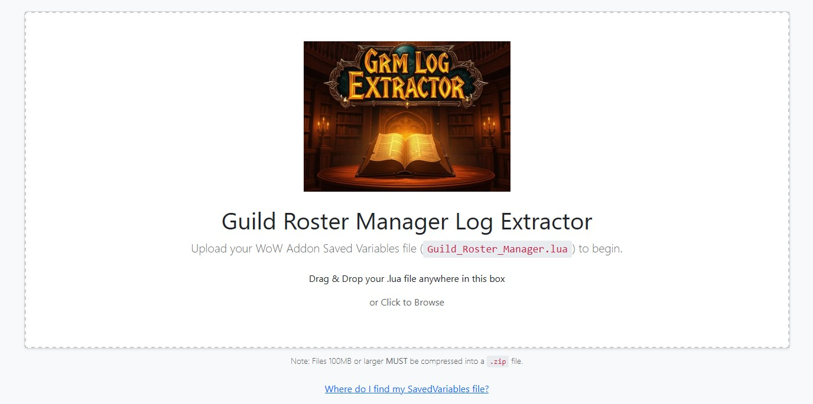
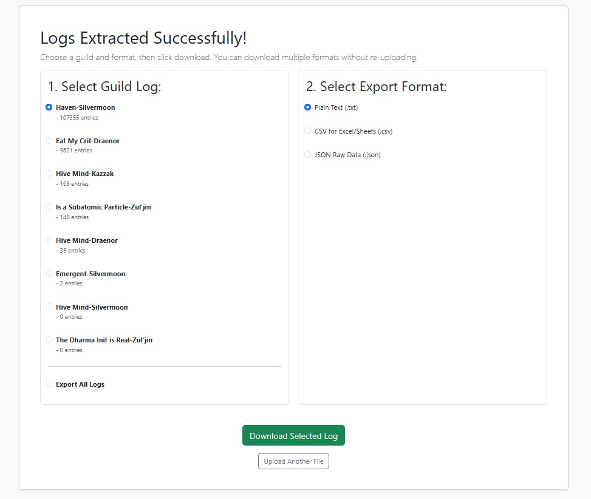

# GRM Log Extractor

> **A web-based utility to parse, sort, and export logs from the Guild Roster Manager (GRM) World of Warcraft addon.**

## 📖 About

The **GRM Log Extractor** solves a common problem for guild officers and leaders, log bloat, and accessing your log outside of the game.

The World of Warcraft addon [Guild Roster Manager](https://www.curseforge.com/wow/addons/guild-roster-manager) stores massive amounts of data in a local `.lua` file. This web application parses that raw data, identifies all guilds stored within it, and allows you to export clean, readable logs in multiple formats. This gives you the freedome to feel comfortable purging your in-game log from lots of data when it grows too large.

## ✨ Key Features

*   **Simple Drag-and-Drop Interface:** Easily upload your `Guild_Roster_Manager.lua` file.
*   **Large File Support:** Automatically handles massive save files. Supports uploading `.zip` archives for files larger than 100MB to bypass browser/network limits. Compressing a lua save file is like 90% smaller.
*   **Multi-Guild Detection:** Automatically detects every guild stored in your save file and lets you choose which one to export.
*   **Multiple Export Formats:**
    *   **CSV:** Perfect for importing into Excel or Google Sheets.
    *   **Text:** A simple, readable list of entries.
    *   **JSON:** Raw data for developers or database imports.
*   **Secure & Private:** No data is permanently stored. Files are processed in memory and discarded immediately after the session ends.

## 📸 Screenshots

### 1. Upload Interface

*Clean, responsive upload interface with support for large files.*

### 2. Selection & Export

*Choose your guild and export format instantly.*

## 🚀 How to Use

1.  **Locate your Save File:**
    *   Go to your WoW installation folder:
    *   `\_retail_\WTF\Account\YOUR_ACCOUNT_NAME\SavedVariables\Guild_Roster_Manager.lua`
2.  **Upload:** Drag the file onto the web page.
    *   *Tip: If your file is over 100MB, right-click and compress it to a `.zip` first!*
3.  **Select:** Choose the guild you want to view.
4.  **Export:** Select your desired format (CSV, Text, JSON) and click Download.

## 🛠️ Built With

*   **Backend:** Python (Flask)
*   **Frontend:** HTML5, Bootstrap 5, JavaScript
*   **Deployment:** Docker & Dokploy

## 👨‍💻 Author

**Aaron Topping (Arkaan / TheGeneticsGuy)**
*   Creator of the [Guild Roster Manager](https://www.curseforge.com/wow/addons/guild-roster-manager) Addon.

---
*Disclaimer: This project is a third-party utility and is not directly affiliated with Blizzard Entertainment.*

